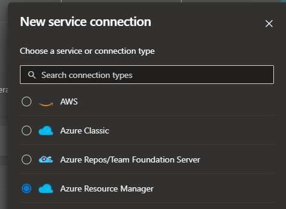
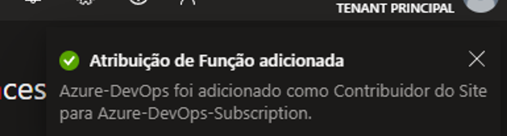

# Como criar Service Connection Azure resource manager no Azure DevOps.

Esse tutorial tem como objetivo criar uma Service Connection com Service Principal do Azure Portal no Azure DevOps.

- **Azure Portal** - O ***portal*** do ***Azure*** é uma interface gráfica do usuário que você pode usar para gerenciar seus serviços do ***Azure***.
- **Azure DevOps** - É um produto da Microsoft que fornece controle de versão, relatórios, gerenciamento de requisitos, gerenciamento de projetos, compilações automatizadas, testes e recursos de gerenciamento de lançamento. → CI/CD

- **Criando uma Service Connection no nosso projeto.**
    
    1 - Acesse seu Projeto no Azure DevOps → Project Settings → Service connections → New Service connections → Azure Resource Manager.
    
    
    
    2 - Clique em Service Principal Manual:
    
    
    
    3 - Agora vamos precisar de algumas informações que vamos encontrar no Azure Portal.
    
    - **Subscription Id**
    - **Subscription Name**
    - **Service Principal Id**
    - **Service principal key**
    - **Tenant ID**
    
    
    
- **Como pegar os dados da Service Connection no Azure Portal.**
    
    1 - Acesse o Portal do Azure → Subscription.
    
    Copie o nome da sua **Subscription** e o **Subscription ID.**
    
    
    
    2 - Acesse o **Microsoft Entra ID** → E copie o **Tenant.**
    
    
    
    3 - Acesse o **Registro de Aplicativos** e crie um novo registro:
    
    
    
    4 - De um nome para seu App registry e clique em registrar.
    
    
    
    5 - Acessando seu App registry, você ira verificar que ele criou o **Service principal key,** copie ele:
    
    
    
    6 - No canto esquerdo, clique em **Certificados e Segredos → Segredos do Cliente → Novo Segredo do Cliente →** Coloque um Descrição para sua Secret → Clique em Adicionar.
    
    
    
    7 - Pronto, ele ira gerar nosso **Service principal key,** copie ele e salve.
    
    
    
    Agora temos todos os dados para criar a Service Connection no Azure DevOps.
    
    - **Subscription Id**
    - **Subscription Name**
    - **Service Principal Id**
    - **Service principal key**
    - **Tenant ID**
- **Como dar permissão para o App registry**
    
    1 - Caso você tenha esse erro, significa que você não deu a permissão correta no app registry lá no Portal.
    
    
    
    2 - Acesse o Azure portal → **Subscription → RBAC (Controle de acesso).**
    
    
    
    3 - Em Função → Função de Trablho, pesquise por: **Web site Contribuitor** ou **Contribuidor do Site** e clique em proximo.
    
    
    
    4 - Clique em **Selecionar Membros** e procure pelo nome do nosso **App Registry** → **Azure-DevOps - Clique em Selecionar → Proximo → Examinar + Atribuir.**
    
    
    
    
    
    5 - Agora pegue todos os dados e volte para o Azure DevOps.
    
    Prencha todos os campos e de um nome para sua Service Connection e **Clique em Verify and Save.**
    
    
    
    6 - Pronto! Nossa Service Connection com o Azure Portal, foi criada no nosso projeto e pode ser usada!
    
    
    

Prontinho! agora a sua SC está criada e já pode usar seus recursos do Azure Portal. 

Qualquer dúvida ou sugestão só informar.